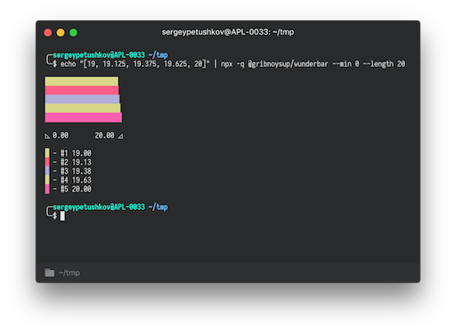
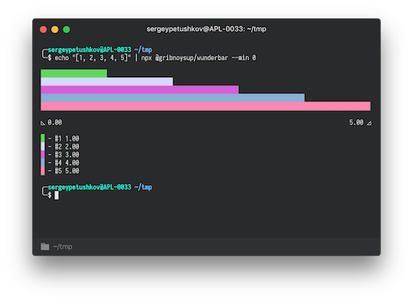
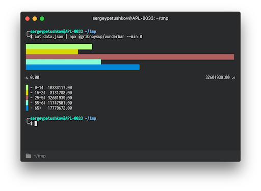

# @gribnoysup/wunderbar

Have you ever wanted to print some pretty bar charts in your terminal? You are
in the right place!


Wunderbar can print horisontal bar chart with legend and chart scale straight to
your terminal. Or you can use it as a module in your code and get all the
building blocks to print chart yourself.

Wunderbar uses partial block characters (`▏▎▍▌▋▊▉█`) to print the most precise
charts possible:



## Use in terminal

```
echo "[1, 2, 3, 4, 5]" | npx @gribnoysup/wunderbar --min 0
```



```
cat data.json | npx @gribnoysup/wunderbar --min 0
```



## Use in your code

```
npm i --save @gribnoysup/wunderbar
```

```js
const wunderbar = require('@gribnoysup/wunderbar');
const data = require('./data.json');

const printData = () => {
  const { chart, legend, scale, __raw } = wunderbar(data, {
    min: 0,
    length: 42,
  });

  console.log();
  console.log(chart);
  console.log();
  console.log(scale);
  console.log();
};

printData();
```

## Limitations

* Wunderbar supports only node >= 6

* Wunderbar uses [`chalk.hex`][1] to add color to your charts. Chalk is pretty
  smart to downgrade the color if it is not supported by your terminal, but
  output may vary in different terminals.

## API

### wunderbar(values, [options]) ⇒ [`OutputValue`][4]

| Param                        | Type                                                                                                     | Default               | Description                                                           |
| ---------------------------- | -------------------------------------------------------------------------------------------------------- | --------------------- | --------------------------------------------------------------------- |
| values                       | `Array<InputValue>`                                                                                      |                       | Values to draw on a chart                                             |
| [options]                    | `Object`                                                                                                 |                       | Chart drawing options                                                 |
| [options.min]                | `number`                                                                                                 | min value from values | Min chart value (inclusive)                                           |
| [options.max]                | `number`                                                                                                 | max value from values | Max chart value (inclusive)                                           |
| [options.length]             | `number`                                                                                                 | terminal width        | Chart length                                                          |
| [options.sort]               | <code>"min" &#124; "max" &#124; "none" &#124; (a: NormalizedValue, b: NormalizedValue) => boolean</code> | `"none"`              | Sort method for chart values                                          |
| [options.randomColorOptions] | `Object`                                                                                                 | `{}`                  | [randomColor options][2] for color generation                         |
| [options.format]             | <code>string &#124; (a: number) => string</code>                                                         | `"0.00"`              | Value format method. String values are [Numeral.js format][7] strings |

All options are also supported in the cli version:

```
echo "[1000, 3000, 5000, 7000, 9000, 11000]" | \
  npx @gribnoysup/wunderbar --min 0 --max 15000 --length 42 --sort min --randomColorOptions '{ "seed": "unicorn" }' --format "0a"
```


### Types

<a name="#InputValue">**InputValue**</a> :
`{ value: number, color?: string, label?: string } | number | string`

<a name="#OutputValue">**OutputValue**</a> :
`{ legend: string, scale: string, chart: string, __raw: RawData }`

<a name="#RawData">**RawData**</a> :
`{ chartLength: number, minValue: number, minValueFormatted: string, maxValue: number, maxValueFormatted: string, normalizedValues: NormalizedValue[] }`

<a name="#NormalizedValue">**NormalizedValue**</a> :
`{ normalizedValue: number, rawValue: number, formattedValue: string, color: string, label: string, lineLength: number, chartBar: string }`

[1]: https://github.com/chalk/chalk#256-and-truecolor-color-support
[2]: https://github.com/davidmerfield/randomColor#options
[3]: #InputValue
[4]: #OutputValue
[5]: #NormalizedValue
[6]: #RawData
[7]: http://numeraljs.com/#format

## License

[MIT](./LICENSE)
